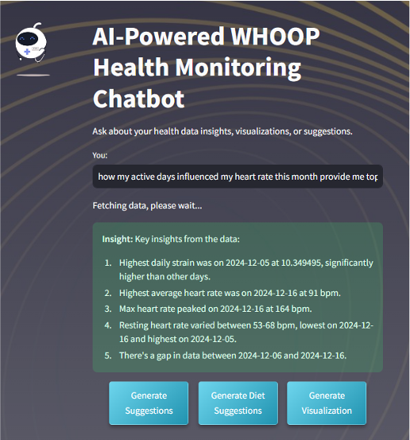

# AI-Powered Health Monitoring & WHOOP Data Integration

## 🚀 Overview
This project combines an **AI-Powered Health Monitoring Chatbot** with a **WHOOP Data Fetch and Store System**, leveraging technologies like **Streamlit**, **Claude AI (Anthropic)**, **PostgreSQL**, and **Flask** for seamless health data analysis and visualization.

### Key Features:
- **AI-Driven Insights:** Dynamic SQL query generation, health insights, and actionable recommendations via Claude AI.
- **Data Visualization:** Interactive charts with Matplotlib/Seaborn based on user queries.
- **WHOOP Integration:** Automates data fetching from the WHOOP API and stores it in PostgreSQL.
- **Interactive UI:** User-friendly chatbot interface built with Streamlit.

---

## 📊 Core Components
1. **Chatbot (Streamlit + Claude AI):**
   - AI-generated SQL queries
   - Health insights & recommendations
   - Dynamic data visualizations

2. **WHOOP Data Fetch System (Flask):**
   - Fetches sleep, workout, recovery, and body data
   - Stores data in PostgreSQL
   - API-triggered data fetching

3. **Database:** PostgreSQL with tables for users, body measurements, workouts, recovery data, etc.

      

## ⚙️ Setup Instructions

### Prerequisites:
- Python 3.8+
- PostgreSQL Database
- WHOOP API Credentials & Claude API Key

### 1. Install Dependencies:
```bash
pip install streamlit anthropic pandas psycopg2-binary matplotlib seaborn flask authlib requests
```

### 2. Configure Database & API:
- Update PostgreSQL credentials:
  ```python
  DB_CONFIG = {
      "database": "health_monitor_whoop",
      "user": "YOUR_USERNAME",
      "password": "YOUR_PASSWORD",
      "host": "YOUR_HOST",
      "port": "xxxx"
  }
  ```
- Add your Anthropic API key:
  ```python
  api_key = "YOUR_ANTHROPIC_API_KEY"
  ```
- WHOOP API credentials:
  ```python
  USERNAME = "your_email@example.com"
  PASSWORD = "your_password"
  ```

### 3. Run Applications:
- **Chatbot:**
  ```bash
  streamlit run app.py
  ```
- **WHOOP Data Fetch API:**
  ```bash
  python whoop_fetch_and_store.py
  ```

---

## 💬 Example Queries
- "What was my average heart rate last week?"
- "How did my sleep patterns change this month?"
- "Provide diet suggestions based on my health trends."

---

## 🛠️ Troubleshooting
- **Database Errors:** Verify PostgreSQL credentials.
- **API Errors:** Check WHOOP & Anthropic API keys.
- **Library Issues:** Reinstall dependencies:
  ```bash
  pip install -r requirements.txt
  ```
---

